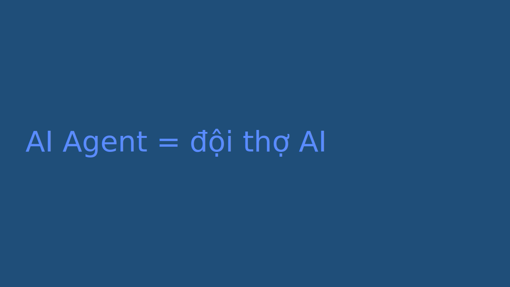

# CONTENT — AI Agent là gì với người làm data (mẫu rút gọn)

## 1. Tư duy & prompt
- Góc nhìn: agent không phải phép thuật, là đội thợ AI có việc rõ ràng.
- Thông điệp lõi: giao đúng việc thì agent mạnh; giao mơ hồ thì loạn.

## 3. Blog chi tiết
<!-- BEGIN BLOG -->
# AI Agent là gì với người làm data — và khi nào KHÔNG nên dùng
**Ngày xưa hỏi "biết code không?". Giờ hỏi "mô tả rõ việc muốn giao không?".**

(nội dung mẫu — thay bằng bài thật khi sản xuất)
<!-- END BLOG -->

## 4. Facebook post
<!-- BEGIN FB_POST -->
https://ducnguyen.vn/atlas/ai/ai-agent-la-gi

Agent không phải phép thuật 🚀 (nội dung mẫu)
<!-- END FB_POST -->
